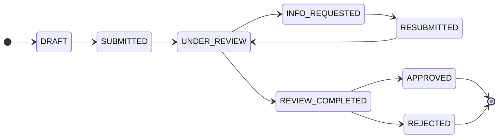

# Architecture — NBR Licensing Portal

## Overview

The portal is a two-service system inside a single repository:

- **`apps/api`** — NestJS REST API, owns the database via Prisma.
- **`apps/web`** — Next.js (App Router) frontend, consumes the API over HTTPS.
- **`packages/shared`** — type-only contracts shared between the two.

The two apps are **co-located** for developer ergonomics but **independently
deployable**. They communicate strictly via the REST API, so they can live on
different hosts, scale independently, and ship on different cadences.

## Why a monorepo

- Single source of truth for cross-app contracts (`@nbr/shared`).
- Atomic PRs that update API + Web together (e.g. when a DTO changes).
- Unified tooling (TypeScript, ESLint, Prettier, CI).

## Why independent deployments

- Each app has its own `package.json`, `Dockerfile`, env contract, and CI
  build job.
- No app imports source from the other; they only meet at:
  - the **build-time contract** (`@nbr/shared`)
  - the **runtime contract** (REST over `NEXT_PUBLIC_API_URL`)
- Compose is for local dev only. Production targets a managed/dedicated host
  per app, with no refactor needed.

## The `@nbr/shared` package — usage rules

Treat `@nbr/shared` as a **contract layer**, not a utility library:

1. Export only `type`, `interface`, `enum`, and primitive `const`.
2. Never import Node-only modules (`fs`, `path`, `crypto`), browser-only
   modules (`window`, `document`), framework-only code (Nest decorators,
   React), or heavy third-party libs (axios, etc.) from this package.
3. Keep `sideEffects: false` so both runtimes can tree-shake aggressively.
4. Treat it as **append-mostly**: changing an existing exported shape is a
   coordinated change touching API + Web in the same PR.
5. Validation classes (`class-validator`) belong in the API; the wire shape
   they validate against lives here as plain interfaces.

Doing all of this means a runtime regression in one app can never reach the
other through the shared package.

## Data flow

```mermaid
flowchart LR
  Browser -->|"HTTPS / JSON"| Web[Next.js (apps/web)]
  Web -->|"REST via NEXT_PUBLIC_API_URL"| API[NestJS (apps/api)]
  API --> DB[(PostgreSQL)]
  API -.uses.-> Shared[("@nbr/shared (types only)")]
  Web -.uses.-> Shared
```

## Module map (API)

| Module           | Responsibility |
| ---------------- | -------------- |
| `auth`           | JWT issuance, login, Passport JWT strategy registration. |
| `users`          | Authenticated profile (`/users/me`) and helpers used by JWT validation (not a full admin user-management console). |
| `applications`   | **Workflow orchestration**: action-oriented REST routes, Prisma transactions, optimistic locking on `Application.version`, audit writes; **not** a generic CRUD status bypass. |
| `workflow`       | **Pure domain rules** only: allowed transitions and role eligibility from [`WORKFLOW_TRANSITIONS`](../packages/shared/src/workflow/workflow-state.const.ts). No HTTP controller. |
| `audit`          | Append-only audit log writes (inside transactions) and read API; DB triggers block `UPDATE`/`DELETE` on `audit_logs`. |
| `documents`      | Local file persistence and versioned metadata; uploads are exposed as **nested** routes under `applications` (no standalone documents controller). |
| `common`         | Cross-cutting pieces: global exception filter, JWT/roles guards, decorators (`@Roles`, `@CurrentUser`). |

## Regulatory and data integrity

- **Workflow**: The only valid status changes are those listed in
  [`WORKFLOW_TRANSITIONS`](../packages/shared/src/workflow/workflow-state.const.ts)
  (single source of truth). **Terminal states** are `APPROVED` and `REJECTED`;
  no further workflow mutations apply.
- **Separation of duties**: The user who moves an application to
  `REVIEW_COMPLETED` is recorded on `Application.reviewCompletedByUserId`.
  The API returns **403** if that same user calls **approve** on that application.
- **Concurrency**: Clients send `expectedVersion` on mutating requests; the API
  uses conditional updates and returns **409 Conflict** when the version does
  not match (optimistic locking).
- **Audit**: Every material action creates an `AuditLog` row in the same
  transaction as the state change. PostgreSQL triggers enforce **append-only**
  audit storage at the database layer.

For a compact transition table and HTTP mapping, see [`api-reference.md`](api-reference.md).

## Workflow overview (high level)



## Future considerations

- Add a `packages/api-client` later if a generated typed client becomes
  preferable to hand-rolled axios calls.
- Promote `audit` to its own service if compliance requirements demand
  storage isolation.
